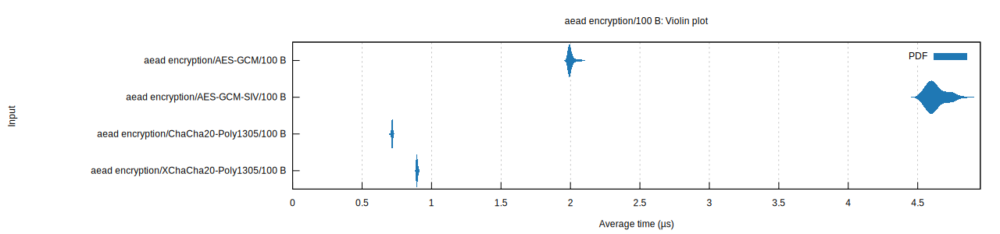

# aead-benchmarks
Rust Crypto benchmarks for AEAD schemes

Benchmarked AEAD schemes:
- AES-GCM
- AES-GCM-SIV
- ChaCha20-Poly1305
- XChaCha20-Poly1305

## Usage
```bash
cargo bench
```

## Results
presented as mean (standard deviation). Violin plots of the following data can be found in the [report](report) directory.

### 100 bytes
||AES-GCM|AES-GCM-SIV|ChaCha20-Poly1305|XChaCha20-Poly1305||
|---|---|---|---|---|---|
|encrypt|1.9966 µs (13.593 ns)|4.6127 µs (55.262 ns)|715.12 ns (3.5670 ns)|894.18 ns (4.5154 ns)|
|decrypt|2.0233 µs (22.905 ns)|4.6052 µs (60.085 ns)|722.09 ns (6.3984 ns)|900.19 ns (4.1358 ns)|



### 16 KibiBytes 
||AES-GCM|AES-GCM-SIV|ChaCha20-Poly1305|XChaCha20-Poly1305||
|---|---|---|---|---|---|
|encrypt|113.74 µs (516.47 ns)|116.77 µs (1.3140 µs)|57.282 µs (298.89 ns)|57.919 µs (498.03 ns)|
|decrypt|114.22 µs (711.60 ns)|119.86 µs (2.3633 µs)|57.361 µs (204.42 ns)|57.342 µs (303.50 ns)|


### 256 KibiBytes
||AES-GCM|AES-GCM-SIV|ChaCha20-Poly1305|XChaCha20-Poly1305||
|---|---|---|---|---|---|
|encrypt|1.8392 ms (29.762 µs)|1.8430 ms (20.566 µs)|918.49 µs (7.8176 µs)|916.19 µs (6.4529 µs)|
|decrypt|1.8199 ms (8.7730 µs)|1.8420 ms (20.201 µs)|919.81 µs (7.2103 µs)|914.03 µs (3.9465 µs)|


### 1 MebiByte
||AES-GCM|AES-GCM-SIV|ChaCha20-Poly1305|XChaCha20-Poly1305||
|---|---|---|---|---|---|
|decrypt|7.3397 ms (106.02 µs)|7.3471 ms (89.159 µs)|3.6742 ms (15.117 µs)|3.6562 ms (16.363 µs)|
|encrypt|7.3485 ms (94.519 µs)|7.3716 ms (75.347 µs)|3.7001 ms (41.346 µs)|3.6727 ms (27.982 µs)|


