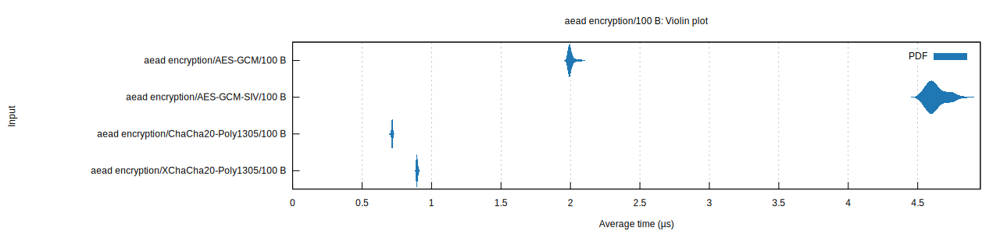
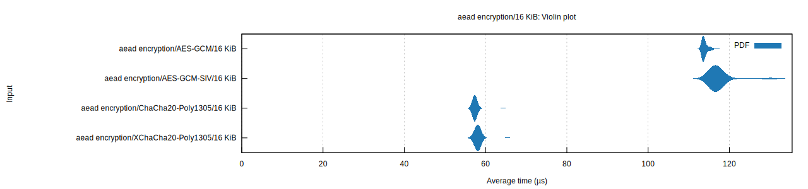
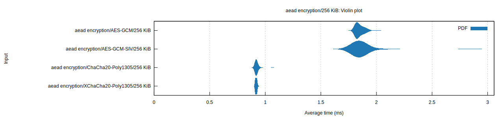
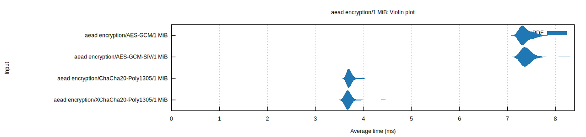

# Criterion results
These results were obtained on an M2 mac with the following hardware overview:

```
Hardware Overview:

  Model Name:	MacBook Pro
  Model Identifier:	Mac14,10
  Model Number:	Z174000EBLL/A
  Chip:	Apple M2 Pro
  Total Number of Cores:	12 (8 performance and 4 efficiency)
  Memory:	32 GB
  System Firmware Version:	10151.140.19
  OS Loader Version:	10151.140.19
```

## 100 bytes
||AES-GCM|AES-GCM-SIV|ChaCha20-Poly1305|XChaCha20-Poly1305||
|---|---|---|---|---|---|
|encrypt|2.0022 µs (22.258 ns)|4.6317 µs (71.780 ns)|716.49 ns (4.8808 ns)|895.70 ns (5.7263 ns)|
|decrypt|2.0381 µs (62.268 ns)|4.6561 µs (217.65 ns)|741.68 ns (83.940 ns)|906.11 ns (33.372 ns)|



## 16 KibiBytes 
||AES-GCM|AES-GCM-SIV|ChaCha20-Poly1305|XChaCha20-Poly1305||
|---|---|---|---|---|---|
|encrypt|113.94 µs (774.97 ns)|117.58 µs (3.3391 µs)|57.495 µs (1.0430 µs)|58.192 µs (1.1941 µs)|
|decrypt|114.84 µs (3.1901 µs)|120.73 µs (3.2922 µs)|57.775 µs (2.5770 µs)|57.793 µs (2.5775 µs)|



## 256 KibiBytes
||AES-GCM|AES-GCM-SIV|ChaCha20-Poly1305|XChaCha20-Poly1305||
|---|---|---|---|---|---|
|encrypt|1.8499 ms (40.798 µs)|1.8724 ms (148.40 µs)|923.61 µs (23.245 µs)|918.29 µs (7.7261 µs)|
|decrypt|1.8229 ms (11.587 µs)|1.8550 ms (61.890 µs)|927.06 µs (32.701 µs)|915.62 µs (6.0435 µs)|



## 1 MebiByte
||AES-GCM|AES-GCM-SIV|ChaCha20-Poly1305|XChaCha20-Poly1305||
|---|---|---|---|---|---|
|encrypt|7.3803 ms (120.27 µs)|7.4067 ms (145.54 µs)|3.7183 ms (71.917 µs)|3.6976 ms (115.56 µs)|
|decrypt|7.3771 ms (143.13 µs)|7.3765 ms (109.77 µs)|3.6955 ms (90.753 µs)|3.6773 ms (90.692 µs)|


